# Design and Implementation of a Low-Code Visual Agent Workflow Platform

## Overview

This platform allows users to **visually build agent workflows** with a drag-and-drop interface, connecting agents' methods as nodes in a flow. It provides a React-based **frontend** for designing workflows and a FastAPI **backend** for executing them. Users can compose sequences of “agent” method calls (from a marketplace/registry) without coding, define parameters via forms, and run the workflow to see step-by-step results. The system also supports saving a created workflow as a **composite agent** that can be reused in new workflows.

```mermaid
graph TD
    %% ===== Styles (Keep Existing) =====
    classDef UI fill:#CCE5FF,stroke:#2F80ED,stroke-width:1px
    classDef Backend fill:#D1C4E9,stroke:#5E35B1,stroke-width:1px
    classDef External fill:#FFF3E0,stroke:#F57C00,stroke-width:1px
    classDef DB fill:#FFCDD2,stroke:#C62828,stroke-width:1px
    classDef UserAction fill:#E8F5E9,stroke:#388E3C
    classDef UIComp fill:#E0F7FA,stroke:#0097A7
    classDef API fill:#FFF9C4,stroke:#FBC02D
    classDef Func fill:#FCE4EC,stroke:#AD1457
    classDef A2A stroke:#0288D1,stroke-width:2px,color:#0288D1,font-style:italic
    classDef Internal stroke:#388E3C,stroke-width:1px,stroke-dasharray:3 3,color:#388E3C
    classDef State fill:#F1F8E9,stroke:#7CB342
    classDef LLMAgent fill:#E1F5FE,stroke:#0277BD

    %% ===== Components =====
    subgraph User [User Interaction]
        U_Load:::UserAction
        U_Drag[Drag Agent/Method]:::UserAction
        U_Drop[Drop onto Canvas]:::UserAction
        U_Connect[Draw Connection]:::UserAction
        U_InputRun:::UserAction
        U_ClickRun:::UserAction
        U_InputSave[Enter Composite Name/Desc]:::UserAction
        U_ClickSave:::UserAction
        U_SelectSink:::UserAction
        U_EnterChatQuery[Enter Chat Query]:::UserAction
    end

    subgraph Frontend
        direction LR
        subgraph LeftPanel ["Left Panel (Agents)"]
            LP_Comp[AgentsPanel.jsx]:::UIComp
        end
        subgraph MiddlePanel
            MP_Comp:::UIComp
            MP_Lib:::UI
        end
        subgraph RightPanel
            RP_Comp:::UIComp
            RP_StateRun:::UI
            RP_StateSave:::UI
            RP_StateDynInputs:::UI
            ChatPanelUI[ChatPanel.jsx]:::UIComp
            ChatPanelState:::UI
        end
        AppComp:::UIComp
    end

    subgraph Backend
        API_Agents:::API
        API_Run:::API
        API_Save:::API
        API_Sinks:::API
        API_Chat:::API
        FN_Execute["execute_workflow_graph()"]:::Func
        FN_LoadComp["load_composite_agents()"]:::Func
        FN_SaveComp["save_composite_agents()"]:::Func
        FN_LoadBase["_get_base_agents_from_registry()"]:::Func
        FN_A2ACall["a2a_call()"]:::Func
        FN_GetSinkDetails:::Func
        Cache["Agent Cache (In-Memory)"]:::Backend
    end

    subgraph ExternalSystems
        %% Existing Base Agents & Storage
        Ext_Registry:::External
        Ext_Composites:::DB
        Ext_AgentA:::External
        Ext_AgentB:::External
        Ext_ExecutorAgent:::External

        %% New Sink Registry Components
        Ext_SinkRegistryAgent:::LLMAgent
        Ext_SinkRegistryStore:::DB

        %% LLM/Support Agents
        Ext_ChatAgent["ChatAgent<br/>(platform_setup_repo)"]:::LLMAgent
        Ext_QueryPlannerAgent["QueryPlannerAgent<br/>(platform_setup_repo)"]:::LLMAgent
        Ext_AnalyticsAgent["AnalyticsAgent<br/>(platform_setup_repo)"]:::LLMAgent

        %% Actual Data Sinks
        Ext_DataSink_HR:::DB
        Ext_DataSink_Logs:::DB
    end

    %% ===== Global State Management & Props Drilling (Existing) =====
    AppComp -- "Holds/Updates" --> State_NodesEdges("Nodes/Edges State"):::State
    AppComp -- "Holds/Updates" --> State_Agents("Agent List State"):::State
    State_NodesEdges -- "Props" --> MP_Comp
    State_NodesEdges -- "Props" --> RP_Comp
    AppComp -- "Props" --> LP_Comp
    AppComp -- "Props" --> RP_Comp
    RP_Comp -- "Updates/Reads" --> RP_StateDynInputs

    %% ===== Chat State Management =====
    AppComp -- "Holds/Updates" --> ChatPanelState
    ChatPanelState -- "Props" --> ChatPanelUI

    %% ===== Flow 1: Load Agents (Unchanged) =====
    U_Load -- "Triggers fetchAgents() in" --> AppComp
    LP_Comp -- "Triggers onRefresh() --> fetchAgents() in" --> AppComp
    AppComp -- "axios.get('/api/agents')" --> API_Agents
    API_Agents -- "Calls" --> FN_LoadBase; API_Agents -- "Calls" --> FN_LoadComp
    FN_LoadBase -- "Uses" --> FN_A2ACall:::A2A; FN_A2ACall -- "Calls" --> Ext_Registry
    FN_LoadComp -- "Reads" --> Ext_Composites:::Internal
    API_Agents -- "Updates" --> Cache:::Internal; API_Agents -- "Response" --> AppComp
    AppComp -- "Updates" --> State_Agents

    %% ===== Flow 2: Build Workflow (Unchanged) =====
    U_Drag -- "On Agent in" --> LP_Comp; LP_Comp -- "onDragStart()" --> U_Drop
    U_Drop -- "Onto" --> MP_Comp; MP_Comp -- "onDrop() creates node" --> AppComp
    AppComp -- "Updates" --> State_NodesEdges; State_NodesEdges -- "(ReactFlow renders)" --> MP_Lib
    U_Connect -- "On Handles in" --> MP_Lib; MP_Lib -- "onConnect() creates edge" --> AppComp
    AppComp -- "Updates" --> State_NodesEdges; State_NodesEdges -- "(ReactFlow renders)" --> MP_Lib

    %% ===== Flow 3: Run Workflow (Unchanged) =====
    U_InputRun -- "Enters Data" --> RP_Comp; RP_Comp -- "Updates" --> RP_StateDynInputs
    U_ClickRun -- "Triggers" --> RP_Comp; RP_Comp -- "handleRun()" --> API_Run
    API_Run -- "Payload" --> FN_Execute
    FN_Execute -- "Orchestrates" --> FN_A2ACall:::A2A; FN_A2ACall -- "Calls" --> Ext_AgentA
    API_Run -- "Response" --> RP_Comp; RP_Comp -- "Updates" --> RP_StateRun

    %% ===== Flow 4: Save Workflow (Unchanged) =====
    U_InputSave -- "Enters Data" --> RP_Comp; U_ClickSave -- "Triggers" --> RP_Comp
    RP_Comp -- "handleSaveWorkflow()" --> API_Save
    API_Save -- "Payload" --> FN_SaveComp; FN_SaveComp -- "Writes" --> Ext_Composites:::Internal
    API_Save -- "Response" --> RP_Comp; RP_Comp -- "Updates" --> RP_StateSave

    %% ===== Flow 5: Load Sinks for Chat UI (New) =====
    ChatPanelUI -- "(onMount) Calls /api/sinks" --> API_Sinks
    API_Sinks -- "Calls list_sinks via" --> FN_A2ACall:::A2A
    FN_A2ACall -- "Calls" --> Ext_SinkRegistryAgent
    Ext_SinkRegistryAgent -- "Reads" --> Ext_SinkRegistryStore:::Internal
    Ext_SinkRegistryAgent -- "Sink List" --> FN_A2ACall
    API_Sinks -- "Sink List Response" --> ChatPanelUI
    ChatPanelUI -- "Updates" --> ChatPanelState

    %% ===== Flow 6: Chat Query Execution (New - Read Only PoC) =====
    U_SelectSink -- "Selects Sink" --> ChatPanelUI
    U_EnterChatQuery -- "Enters Query" --> ChatPanelUI
    ChatPanelUI -- "handleSend() POSTs to" --> API_Chat
    API_Chat -- "Calls Sink Registry via" --> FN_GetSinkDetails
    FN_GetSinkDetails -- "Uses" --> FN_A2ACall:::A2A; FN_A2ACall -- "Calls get_sink_details" --> Ext_SinkRegistryAgent
    Ext_SinkRegistryAgent -- "Reads" --> Ext_SinkRegistryStore:::Internal
    Ext_SinkRegistryAgent -- "Sink Metadata" --> FN_A2ACall
    FN_A2ACall -- "Sink Metadata" --> API_Chat
    API_Chat -- "Calls Chat Agent via" --> FN_A2ACall:::A2A
    FN_A2ACall -- "Calls process_message" --> Ext_ChatAgent
    subgraph ChatAgentOrchestration [Chat Agent Orchestration]
        direction LR
        Ext_ChatAgent -- "1. Calls Planner" --> FN_A2ACall_Planner(FN_A2ACall):::A2A
        FN_A2ACall_Planner -- "generate_query(query, sink_meta)" --> Ext_QueryPlannerAgent
        Ext_QueryPlannerAgent -- "2. Returns Plan (query, target_method)" --> FN_A2ACall_Planner
        FN_A2ACall_Planner -- "Plan" --> Ext_ChatAgent
        Ext_ChatAgent -- "3. Calls Executor" --> FN_A2ACall_Executor(FN_A2ACall):::A2A
        FN_A2ACall_Executor -- "execute_query(query)" --> Ext_ExecutorAgent
        Ext_ExecutorAgent -- "4. Queries Actual Sink" --> Ext_DataSink_HR
        Ext_DataSink_HR -- "5. Results" --> Ext_ExecutorAgent
        Ext_ExecutorAgent -- "6. Results" --> FN_A2ACall_Executor
        FN_A2ACall_Executor -- "Results" --> Ext_ChatAgent
        Ext_ChatAgent -- "7. (Optional) Calls Analytics" --> FN_A2ACall_Analytics(FN_A2ACall):::A2A
        FN_A2ACall_Analytics -- "generate_visualization(results)" --> Ext_AnalyticsAgent
        Ext_AnalyticsAgent -- "8. Image/Error" --> FN_A2ACall_Analytics
        FN_A2ACall_Analytics -- "Image/Error" --> Ext_ChatAgent
        Ext_ChatAgent -- "9. Formats Final Response" --> Ext_ChatAgent
    end
    Ext_ChatAgent -- "Final Response" --> FN_A2ACall
    API_Chat -- "Final Response" --> ChatPanelUI
    ChatPanelUI -- "Updates" --> ChatPanelState; ChatPanelState -- "(React renders)" --> ChatPanelUI
    ChatPanelUI -- "Displays Response" --> User

```

## Frontend: Visual Workflow Builder (React + ReactFlow)

The frontend is built with **React** (TypeScript) and utilizes **ReactFlow** for the node-based UI. Key components of the frontend include:

### Agents & Methods Panel

* A sidebar panel lists all available **agents** and their methods (fetched from the A2A registry). Each entry is a draggable item representing an agent’s method (e.g. “SalesforceAgent.createLead”).
* The list is populated by querying the backend’s registry endpoint on load. New composite agents (workflows saved by the user) also appear here after registration, so the palette is always up-to-date.

### Drag-and-Drop Node Canvas

* Users construct a workflow by  **dragging a method from the panel onto the canvas** . This creates a node in the ReactFlow diagram representing that method.
* Under the hood, ReactFlow’s drag-and-drop support is used. We define a custom `<Sidebar>` with draggable items and handle `onDragStart` and `onDrop` events to add new nodes to the flow [reactflow.dev](https://reactflow.dev/examples/interaction/drag-and-drop#:~:text=const%20onDragStart%20%3D%20,effectAllowed%20%3D%20%27move%27%3B)[reactflow.dev](https://reactflow.dev/examples/interaction/drag-and-drop#:~:text=onDragStart%3D,div). Each node gets a unique ID and stores metadata like the agent/method name and a reference to its parameters.
* The canvas uses ReactFlow’s `<ReactFlow>` component to render nodes and edges. We enable features like zoom/pan and use built-in controls (mini-map, etc.) for better UX. The nodes are visually labeled with the method name (and possibly the agent name or an icon).

### Connecting Nodes with Edges (Defining Execution Order)

* Users can draw **connections (edges)** between nodes to define the execution sequence. In the flow, a directed edge from Node A to Node B means “execute A before B, and pass A’s results into B”. Nodes and edges form a directed acyclic graph (DAG) representing the workflow logic [getzep.com](https://www.getzep.com/ai-agents/langchain-agents-langgraph#:~:text=Nodes%20and%20Edges%3A%20Nodes%20represent,data%20and%20control%20between%20nodes).
* ReactFlow handles edge creation via user dragging from a node’s output handle to another node’s input handle. Each node type can be configured with output and input connectors. We can also enforce no cyclic connections (prevent loops) by checking connections (ReactFlow provides an example to **prevent cycles** in the graph).
* The **start node** is the one with no incoming edges (or the user can explicitly mark a start). The flow can have branching if multiple edges originate from one node, but typically execution will follow the drawn arrows sequentially or in parallel if branches diverge.

## How to Test It End-to-End

1. ✅ Make sure the following containers are up:
   <pre class="overflow-visible!" data-start="1464" data-end="1557">

<button class="flex gap-1 items-center select-none px-4 py-1" aria-label="Copy"><svg width="24" height="24" viewBox="0 0 24 24" fill="none" xmlns="http://www.w3.org/2000/svg" class="icon-xs"><path fill-rule="evenodd" clip-rule="evenodd" d="M7 5C7 3.34315 8.34315 2 10 2H19C20.6569 2 22 3.34315 22 5V14C22 15.6569 20.6569 17 19 17H17V19C17 20.6569 15.6569 22 14 22H5C3.34315 22 2 20.6569 2 19V10C2 8.34315 3.34315 7 5 7H7V5ZM9 7H14C15.6569 7 17 8.34315 17 10V15H19C19.5523 15 20 14.5523 20 14V5C20 4.44772 19.5523 4 19 4H10C9.44772 4 9 4.44772 9 5V7ZM5 9C4.44772 9 4 9.44772 4 10V19C4 19.5523 4.44772 20 5 20H14C14.5523 20 15 19.5523 15 19V10C15 9.44772 14.5523 9 14 9H5Z" fill="currentColor"></path></svg>Copy</button><button class="flex items-center gap-1 px-4 py-1 select-none"><svg width="24" height="24" viewBox="0 0 24 24" fill="none" xmlns="http://www.w3.org/2000/svg" class="icon-xs"><path d="M2.5 5.5C4.3 5.2 5.2 4 5.5 2.5C5.8 4 6.7 5.2 8.5 5.5C6.7 5.8 5.8 7 5.5 8.5C5.2 7 4.3 5.8 2.5 5.5Z" fill="currentColor" stroke="currentColor" stroke-linecap="round" stroke-linejoin="round"></path><path d="M5.66282 16.5231L5.18413 19.3952C5.12203 19.7678 5.09098 19.9541 5.14876 20.0888C5.19933 20.2067 5.29328 20.3007 5.41118 20.3512C5.54589 20.409 5.73218 20.378 6.10476 20.3159L8.97693 19.8372C9.72813 19.712 10.1037 19.6494 10.4542 19.521C10.7652 19.407 11.0608 19.2549 11.3343 19.068C11.6425 18.8575 11.9118 18.5882 12.4503 18.0497L20 10.5C21.3807 9.11929 21.3807 6.88071 20 5.5C18.6193 4.11929 16.3807 4.11929 15 5.5L7.45026 13.0497C6.91175 13.5882 6.6425 13.8575 6.43197 14.1657C6.24513 14.4392 6.09299 14.7348 5.97903 15.0458C5.85062 15.3963 5.78802 15.7719 5.66282 16.5231Z" stroke="currentColor" stroke-width="2" stroke-linecap="round" stroke-linejoin="round"></path><path d="M14.5 7L18.5 11" stroke="currentColor" stroke-width="2" stroke-linecap="round" stroke-linejoin="round"></path></svg>Edit</button>

<code class="whitespace-pre!">auth_agent, webservice_agent, webcrawler_agent, fake_auth_service, a2a_registry
   </code>

</pre>
2. ✅ Make sure `http://localhost:8104/a2a` returns valid JSON-RPC for `list_agents`.
3. ✅ Run backend:
   <pre class="overflow-visible!" data-start="1666" data-end="1753">

bash

<button class="flex gap-1 items-center select-none px-4 py-1" aria-label="Copy"><svg width="24" height="24" viewBox="0 0 24 24" fill="none" xmlns="http://www.w3.org/2000/svg" class="icon-xs"><path fill-rule="evenodd" clip-rule="evenodd" d="M7 5C7 3.34315 8.34315 2 10 2H19C20.6569 2 22 3.34315 22 5V14C22 15.6569 20.6569 17 19 17H17V19C17 20.6569 15.6569 22 14 22H5C3.34315 22 2 20.6569 2 19V10C2 8.34315 3.34315 7 5 7H7V5ZM9 7H14C15.6569 7 17 8.34315 17 10V15H19C19.5523 15 20 14.5523 20 14V5C20 4.44772 19.5523 4 19 4H10C9.44772 4 9 4.44772 9 5V7ZM5 9C4.44772 9 4 9.44772 4 10V19C4 19.5523 4.44772 20 5 20H14C14.5523 20 15 19.5523 15 19V10C15 9.44772 14.5523 9 14 9H5Z" fill="currentColor"></path></svg>Copy</button><button class="flex items-center gap-1 px-4 py-1 select-none"><svg width="24" height="24" viewBox="0 0 24 24" fill="none" xmlns="http://www.w3.org/2000/svg" class="icon-xs"><path d="M2.5 5.5C4.3 5.2 5.2 4 5.5 2.5C5.8 4 6.7 5.2 8.5 5.5C6.7 5.8 5.8 7 5.5 8.5C5.2 7 4.3 5.8 2.5 5.5Z" fill="currentColor" stroke="currentColor" stroke-linecap="round" stroke-linejoin="round"></path><path d="M5.66282 16.5231L5.18413 19.3952C5.12203 19.7678 5.09098 19.9541 5.14876 20.0888C5.19933 20.2067 5.29328 20.3007 5.41118 20.3512C5.54589 20.409 5.73218 20.378 6.10476 20.3159L8.97693 19.8372C9.72813 19.712 10.1037 19.6494 10.4542 19.521C10.7652 19.407 11.0608 19.2549 11.3343 19.068C11.6425 18.8575 11.9118 18.5882 12.4503 18.0497L20 10.5C21.3807 9.11929 21.3807 6.88071 20 5.5C18.6193 4.11929 16.3807 4.11929 15 5.5L7.45026 13.0497C6.91175 13.5882 6.6425 13.8575 6.43197 14.1657C6.24513 14.4392 6.09299 14.7348 5.97903 15.0458C5.85062 15.3963 5.78802 15.7719 5.66282 16.5231Z" stroke="currentColor" stroke-width="2" stroke-linecap="round" stroke-linejoin="round"></path><path d="M14.5 7L18.5 11" stroke="currentColor" stroke-width="2" stroke-linecap="round" stroke-linejoin="round"></path></svg>Edit</button>

<code class="whitespace-pre! language-bash">cd low_code_platform/backend
   uvicorn main:app --reload --port 9001
   </code>

</pre>
4. ✅ Run frontend:
   <pre class="overflow-visible!" data-start="1777" data-end="1824">

bash

<button class="flex gap-1 items-center select-none px-4 py-1" aria-label="Copy"><svg width="24" height="24" viewBox="0 0 24 24" fill="none" xmlns="http://www.w3.org/2000/svg" class="icon-xs"><path fill-rule="evenodd" clip-rule="evenodd" d="M7 5C7 3.34315 8.34315 2 10 2H19C20.6569 2 22 3.34315 22 5V14C22 15.6569 20.6569 17 19 17H17V19C17 20.6569 15.6569 22 14 22H5C3.34315 22 2 20.6569 2 19V10C2 8.34315 3.34315 7 5 7H7V5ZM9 7H14C15.6569 7 17 8.34315 17 10V15H19C19.5523 15 20 14.5523 20 14V5C20 4.44772 19.5523 4 19 4H10C9.44772 4 9 4.44772 9 5V7ZM5 9C4.44772 9 4 9.44772 4 10V19C4 19.5523 4.44772 20 5 20H14C14.5523 20 15 19.5523 15 19V10C15 9.44772 14.5523 9 14 9H5Z" fill="currentColor"></path></svg>Copy</button><button class="flex items-center gap-1 px-4 py-1 select-none"><svg width="24" height="24" viewBox="0 0 24 24" fill="none" xmlns="http://www.w3.org/2000/svg" class="icon-xs"><path d="M2.5 5.5C4.3 5.2 5.2 4 5.5 2.5C5.8 4 6.7 5.2 8.5 5.5C6.7 5.8 5.8 7 5.5 8.5C5.2 7 4.3 5.8 2.5 5.5Z" fill="currentColor" stroke="currentColor" stroke-linecap="round" stroke-linejoin="round"></path><path d="M5.66282 16.5231L5.18413 19.3952C5.12203 19.7678 5.09098 19.9541 5.14876 20.0888C5.19933 20.2067 5.29328 20.3007 5.41118 20.3512C5.54589 20.409 5.73218 20.378 6.10476 20.3159L8.97693 19.8372C9.72813 19.712 10.1037 19.6494 10.4542 19.521C10.7652 19.407 11.0608 19.2549 11.3343 19.068C11.6425 18.8575 11.9118 18.5882 12.4503 18.0497L20 10.5C21.3807 9.11929 21.3807 6.88071 20 5.5C18.6193 4.11929 16.3807 4.11929 15 5.5L7.45026 13.0497C6.91175 13.5882 6.6425 13.8575 6.43197 14.1657C6.24513 14.4392 6.09299 14.7348 5.97903 15.0458C5.85062 15.3963 5.78802 15.7719 5.66282 16.5231Z" stroke="currentColor" stroke-width="2" stroke-linecap="round" stroke-linejoin="round"></path><path d="M14.5 7L18.5 11" stroke="currentColor" stroke-width="2" stroke-linecap="round" stroke-linejoin="round"></path></svg>Edit</button>

<code class="whitespace-pre! language-bash">cd ../frontend
   npm run dev
   </code>

</pre>
5. ✅ Open browser: [http://localhost:5173](http://localhost:5173)
6. In the UI:
   * **Left Panel** : Click “Refresh” → shows agent list
   * **Middle Panel** : Hardcoded graph (Node1: `auth_agent.login` → Node2: `webservice_agent.search_candidates`)
   * **Right Panel** : Enter credentials (`admin` / `secret`) and job info, then click **Run**
7. ✅ You’ll see:
   * Step 1: `auth_agent.login` returns token
   * Step 2: `webservice_agent.search_candidates` returns **5 mock candidates**
   * ✅ Final candidate list is shown in the log viewer (like your CLI output)

---

## 🛠️ Next Feature: Add `create_record` Node

To **fully mirror** the HRRecruitingAssistant, the next step is to add a third node:

### ➕ `dbservice_agent.create_record`

Each candidate is:

* Sent via a loop to `dbservice_agent` (just like `save_candidates` in LangGraph)
* Saved into `candidates.db`

Would you like me to:

* Show you how to add this 3rd node in the UI version?
* Or fully integrate it and drop updated code?
*
