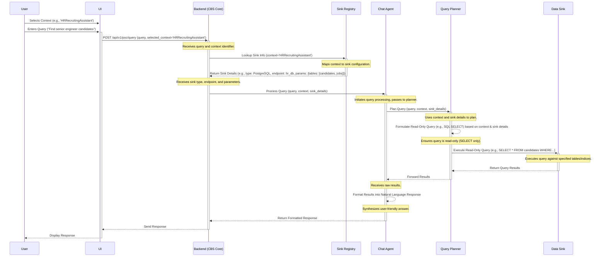

# Centralized Broadcaster Service: Proof of Concept Architecture for Read-Only Contextual Queries

## 1. Introduction

### 1.1. Purpose

This document provides a detailed technical specification for a Proof of Concept (PoC) implementation of the Centralized Broadcaster Service (CBS). The primary objective of this specification is to outline an architecture focused specifically on the processing of read-only chat queries initiated by users. A key aspect of this PoC is the mechanism for explicit user selection of the operational context (referred to as the `composite_agent_context`) and the subsequent handling of this context within the backend system to ensure queries are directed appropriately, while deferring authorization enforcement.

### 1.2. PoC Scope Definition

The scope of this PoC is intentionally constrained to validate core architectural concepts and data flow mechanisms under simplified conditions. The following boundaries define this scope:

* **Read-Only Operations:** The PoC will exclusively handle queries that retrieve information without modifying the state of backend data sources. All query generation and execution logic must adhere to this read-only constraint. This significantly simplifies the requirements for agent logic (particularly the `query_planner_agent`) and interactions with data sinks during this initial validation phase. Write operations, updates, or deletions are explicitly excluded.
* **Deferred Authorization:** All authorization checks and enforcement mechanisms are deferred for this PoC implementation. While security is paramount in a production system, omitting it here allows the development team to concentrate entirely on establishing the fundamental data flow, context handling, and agent orchestration logic without the added complexity of integrating access control policies.
* **Explicit Context Selection:** The PoC mandates that the user explicitly selects the desired `composite_agent_context` (e.g., 'HRRecruitingAssistant', 'logagent') through the User Interface (UI). This approach bypasses the need for potentially complex Natural Language Understanding (NLU) or inference mechanisms to determine the user's intended context, thereby simplifying the UI-to-backend interaction and the initial processing steps within the backend service for this PoC.

### 1.3. Core Functionality

The core functionality targeted by this PoC involves the following sequence: A user interacts with a chat interface, selects a specific operational context relevant to their query (e.g., 'HRRecruitingAssistant' for recruitment-related questions), and submits a natural language query. The CBS backend receives this query along with the selected context identifier. It then utilizes a Sink Registry component to determine the appropriate backend data source(s) associated with the provided context. Subsequently, it orchestrates specialized backend agents (specifically, the `chat_agent` and `query_planner_agent`) to process the query, generate a read-only execution plan targeting the correct data sink, retrieve the relevant information, and formulate a response to be presented back to the user via the UI.

### 1.4. Document Structure

This document is organized as follows: Section 2 provides an overview of the PoC architecture and its key components. Section 3 details the mechanism for user context selection in the UI and its transmission to the backend. Section 4 describes how the backend processes the received context and utilizes the Sink Registry to resolve the target data sink. Section 5 outlines the invocation of backend agents and the execution of context-aware, read-only queries. Section 6 presents a sequence diagram illustrating the end-to-end query flow. Section 7 provides specific implementation notes relevant to the PoC. Finally, Section 8 concludes with a summary of the proposed architecture and its alignment with the PoC objectives.

## 2. PoC Read-Only Query Architecture Overview

### 2.1. System Context

The Centralized Broadcaster Service (CBS) is envisioned as an intermediary layer designed to facilitate seamless and contextually relevant interactions between end-users and a diverse array of backend data sources, tools, and services. It achieves this by employing conversational agents capable of understanding user intent, planning query execution, and interacting with appropriate systems based on the established context. This Proof of Concept implements a carefully scoped subset of this vision, focusing specifically on the read-only query pathway driven by explicit user context selection.

### 2.2. Key Components

The following components are essential for realizing the read-only query flow within this PoC:

* **User Interface (UI):** Serves as the primary interaction point for the end-user. Its responsibilities within this PoC include capturing the user's natural language query and, critically, providing a clear mechanism for the user to explicitly select the intended `composite_agent_context`. This selection dictates the operational domain for the subsequent query processing.
* **Backend Service (CBS Core):** Acts as the central orchestrator and primary API endpoint for the system. It receives requests (query and context) from the UI, validates the input, manages the interaction with the Sink Registry to determine the target data sink, invokes and coordinates the relevant backend agents (`chat_agent`, `query_planner_agent`), and ultimately returns the processed response to the UI.
* **Sink Registry:** A vital infrastructural component functioning as a lookup or discovery service. Its core responsibility is to maintain a mapping between `composite_agent_context` identifiers and the configuration details required to interact with the corresponding target data sink(s). This includes information such as sink type, connection endpoints, and potentially context-specific parameters. The registry provides a crucial layer of abstraction, decoupling the core orchestration logic from the specifics of individual data source implementations.
* **Chat Agent (`chat_agent`):** Primarily responsible for managing the conversational flow and user interaction aspects. In the context of this simplified PoC focused on single-turn, read-only queries, its role might be streamlined. It will likely receive the query and context from the backend, potentially perform minor formatting or clarification, interact with the `query_planner_agent`, receive the results, and format the final natural language response for the user. Maintaining complex dialogue history is likely deferred.
* **Query Planner Agent (`query_planner_agent`):** A specialized agent tasked with translating the user's natural language query, informed by the provided context and sink details, into a structured, executable query suitable for the target data sink. A critical constraint for this PoC is that the generated query must be strictly read-only. It leverages the information obtained from the Sink Registry (via the backend) to ensure the query targets the correct data structures within the designated sink.
* **Data Sinks:** Represent the actual repositories of information that the CBS interacts with. These can be heterogeneous systems, such as relational databases (e.g., PostgreSQL), search engines (e.g., Elasticsearch), document stores, or vector databases. For this PoC, interactions with these sinks will be strictly limited to read-only operations, as dictated by the `query_planner_agent`.

### 2.3. High-Level Flow

The conceptual sequence of operations for a read-only query in this PoC architecture is as follows:

1. The User selects a `composite_agent_context` via the UI.
2. The User submits a natural language query via the UI.
3. The UI sends the query and the selected context identifier to the Backend Service API endpoint.
4. The Backend Service receives the request.
5. The Backend Service queries the Sink Registry using the provided context identifier.
6. The Sink Registry returns the configuration details for the associated data sink (type, endpoint, parameters).
7. The Backend Service invokes the `chat_agent` and subsequently the `query_planner_agent`, passing the query, resolved context information, and sink details.
8. The `query_planner_agent` formulates a context-aware, read-only query specific to the target sink type.
9. The `query_planner_agent` (or an underlying execution layer) executes the query against the designated Data Sink.
10. The Data Sink returns the query results.
11. The Agents process the raw results and format a user-friendly response.
12. The Backend Service receives the formatted response from the agents.
13. The Backend Service sends the response back to the UI.
14. The UI displays the response to the User.

### 2.4. Architectural Considerations for Extensibility

The deliberate architectural separation of the Sink Registry represents a foundational design choice that significantly enhances the system's potential for future extensibility, even within the constrained scope of this PoC. By encapsulating the mapping logic between operational contexts and specific data sink configurations within a dedicated component, the core backend orchestration logic remains agnostic to the particulars of how and where data for a given context resides. This abstraction is paramount. Should the need arise to introduce a new context (e.g., 'FinanceAssistant') or support a new type of data sink (e.g., a specific graph database), modifications can be largely confined to the Sink Registry's configuration or implementation. The Backend Service's interaction pattern with the registry (querying by context identifier) remains unchanged, minimizing the impact on the central orchestration flow and reducing the risk associated with evolving the system. Establishing this clean interface early, even if the initial registry implementation is simple (like a configuration file), aligns with sound distributed systems principles and paves the way for more seamless scaling and adaptation in subsequent development phases.

## 3. Context Selection and Transmission

### 3.1. UI Mechanism for Context Selection

To fulfill the PoC requirement for explicit context selection, the User Interface (UI) must provide a clear and unambiguous mechanism for the user to specify the desired `composite_agent_context` before or during query submission. A recommended implementation approach involves using standard UI elements such as:

* **Dropdown Menu:** A dropdown list populated with the names of available, predefined contexts (e.g., 'HRRecruitingAssistant', 'logagent', 'DocQAAssistant'). The user selects one option from the list.
* **Selectable Buttons/Tags:** A set of clearly labeled buttons or tags, each representing a specific context. The user clicks the button corresponding to their intended context.

The choice between these options depends on the overall UI design and the anticipated number of contexts. The key principle is that the selection must be explicit and easily discoverable by the user. This method directly addresses the PoC's goal of simplifying context handling by removing ambiguity and eliminating the need for backend NLU solely for context detection at this stage. The selected context should ideally remain active or visible within the UI for the duration of a relevant conversational turn or task, and the user should be able to change it easily for subsequent queries.

### 3.2. Context Definition

The term `composite_agent_context` refers to a potentially rich definition encompassing not just a name but also associated metadata, constraints, default parameters, or pointers to relevant knowledge required for agents to operate effectively within that domain. However, for the transmission from the UI to the backend in this PoC, only the unique *identifier* or *name* of the selected context (e.g., the string "HRRecruitingAssistant") needs to be sent. The backend system, in conjunction with the Sink Registry, will be responsible for resolving this identifier into the fuller context definition if required by downstream components like the agents.

### 3.3. Transmission to Backend

The selected context identifier and the user's natural language query must be transmitted from the UI to the Backend Service (CBS Core). This communication should adhere to standard web service practices:

* **API Endpoint:** A dedicated API endpoint should be defined within the Backend Service to handle these PoC queries. A suggested path is `/api/v1/poc/query`. Defining a clear API contract is essential for decoupling the UI and backend development.
* **HTTP Method:** The HTTP POST method is appropriate for sending the query data to the backend, as it involves submitting data to be processed.
* **Payload Structure:** The request body should contain both the user's query and the selected context identifier, preferably structured using JSON for broad interoperability. An example payload structure is:

  **JSON**

  ```
  {
    "query": "Find candidates suitable for the Senior Engineer role",
    "selected_context": "HRRecruitingAssistant"
  }
  ```
* **Data Format:** JSON is the recommended data format for the request payload due to its widespread support and ease of parsing.

### 3.4. Implications of Identifier-Based Transmission

The design choice to transmit only the simple `selected_context` identifier (e.g., "HRRecruitingAssistant") from the UI simplifies the UI's responsibility but places a requirement on the backend system. The backend, upon receiving this identifier, must have a mechanism to resolve it into a potentially more detailed representation of the `composite_agent_context`. This richer context might be needed not only for the Sink Registry lookup but also by the `chat_agent` or `query_planner_agent` to perform their tasks accurately (e.g., applying default filters, understanding domain-specific vocabulary, or identifying relevant data fields). This resolution might involve querying the Sink Registry itself (if it stores more than just sink details) or consulting another configuration service or database that holds the comprehensive definitions associated with each context identifier. Therefore, an implicit requirement exists within the backend for a context definition resolution mechanism that translates the simple string received from the UI into the actionable information needed by various internal components.

## 4. Backend Context Processing and Sink Resolution

### 4.1. Request Handling

Upon receiving a POST request at the designated API endpoint (e.g., `/api/v1/poc/query`), the Backend Service (CBS Core) initiates the processing sequence. The first step involves parsing the incoming JSON payload to extract the user's `query` and the `selected_context` identifier. Basic validation should be performed at this stage, ensuring that both required fields are present and potentially checking if the `selected_context` identifier corresponds to a known context format, although the definitive check occurs during the Sink Registry lookup.

### 4.2. Context Resolution

As established previously, the backend receives a simple identifier (e.g., "HRRecruitingAssistant") representing the user's selected context. While the primary use of this identifier in the immediate flow is to query the Sink Registry, the backend may need to resolve this identifier into a more comprehensive `composite_agent_context` object. This resolved object might contain additional metadata, default parameters, or constraints pertinent to the context, which could be necessary for the subsequent agent invocation step. This resolution step might involve looking up the identifier in a dedicated configuration store or potentially retrieving extended details from the Sink Registry itself, depending on its design.

### 4.3. Sink Registry Interaction

The interaction with the Sink Registry is a critical step in routing the query correctly.

* **Lookup Operation:** The Backend Service uses the `selected_context` identifier received from the UI as the primary key to query the Sink Registry.
* **Registry Function:** The fundamental purpose of the Sink Registry is to perform this lookup, mapping the provided context identifier to the specific technical details required to interact with the appropriate backend data sink(s). The information returned by the registry is crucial for the `query_planner_agent` to formulate and execute the query. At a minimum, this information must include:
  * **Target Sink Type:** An identifier specifying the kind of data sink (e.g., 'PostgreSQL', 'Elasticsearch', 'VectorDB', 'REST API'). This informs the `query_planner_agent` about the query language and protocol to use.
  * **Target Sink Identifier/Endpoint:** Connection details necessary to reach the specific instance of the data sink (e.g., a database connection string, a service URL, an index name, a cluster address).
  * **Context-Specific Parameters (Optional but Recommended):** Additional parameters that guide the query generation within the specific context. Examples include relevant table or collection names, specific search indices, default filters or query templates, or relevant fields/columns to query within the sink.
* **Registry Implementation (PoC):** For the purposes of this PoC, the Sink Registry does not need to be a complex microservice. It can be implemented using simpler approaches, provided it exposes a clear interface for lookup based on the context identifier. Suitable options include:
  * A static configuration file (e.g., YAML, JSON) loaded by the Backend Service at startup.
  * A simple key-value store (e.g., Redis, etcd).
  * A dedicated table within a relational or NoSQL database.
    The key architectural benefit lies in the abstraction provided by the registry interface, not necessarily the complexity of its initial implementation.

### 4.4. Handling Lookup Results

The Backend Service must handle the response from the Sink Registry appropriately. If the lookup is successful, the service receives the necessary sink details (type, endpoint, parameters). If the `selected_context` identifier provided by the UI does not correspond to any entry in the Sink Registry, this indicates a configuration error or an invalid context selection. In such cases, the Backend Service should not proceed further down the query processing pipeline but should instead return an appropriate error response to the UI, informing the user that the selected context is not recognized or configured.

### 4.5. Context-to-Sink Mapping Configuration Example

To illustrate the type of information managed by the Sink Registry, the following table provides an example of how contexts might map to sink details:

| **composite_agent_context Identifier** | **Target Sink Type** | **Target Sink Identifier/Endpoint** | **Context-Specific Parameters (Example)** |
| -------------------------------------------- | -------------------------- | ----------------------------------------- | ----------------------------------------------- |
| `HRRecruitingAssistant`                    | PostgreSQL                 | `hr_prod_db_read_replica`               | `{"tables": ["candidates", "jobs"]}`          |
| `logagent`                                 | Elasticsearch              | `prod_logs_cluster`                     | `{"index": "app-logs-*"}`                     |
| `DocQAAssistant`                           | VectorDB                   | `internal_docs_vector_store`            | `{"collection": "policy_docs"}`               |

This table clearly demonstrates the registry's role in linking a functional context selected by the user to the concrete technical details needed to access the relevant data.

### 4.6. Influence of Registry Detail on Agent Complexity

The level of detail provided by the Sink Registry in its response directly influences the required complexity and context-awareness of the `query_planner_agent`. Consider two possibilities:

1. **Minimal Registry Information:** If the registry only returns the sink type and endpoint (e.g., 'PostgreSQL', `hr_prod_db_read_replica`), the `query_planner_agent` must possess internal logic specific to the 'HRRecruitingAssistant' context to know *which* tables (e.g., `candidates`, `jobs`) within that database are relevant for answering recruitment queries. This embeds context-specific data access knowledge within the agent itself.
2. **Detailed Registry Information:** If the registry returns the sink type, endpoint, *and* relevant parameters like table names (as shown in the example table), the `query_planner_agent` can be designed more generically. Its task becomes: "Given the user query, formulate a SQL query targeting the provided tables (`candidates`, `jobs`) in the specified PostgreSQL database." The context-specific knowledge (which tables are relevant) is externalized into the Sink Registry's configuration.

For a PoC aiming for rapid development and potentially simpler agent logic initially, designing the Sink Registry to provide richer, context-specific parameters can be advantageous. It centralizes the configuration of *how* a context maps to data, making the agents themselves potentially less context-bound and easier to adapt or reuse. This decision represents a trade-off between configuration complexity in the registry and logical complexity within the agents.

## 5. Agent Invocation and Query Execution

### 5.1. Agent Orchestration

Once the Backend Service has successfully retrieved the data sink configuration details from the Sink Registry based on the `selected_context`, it proceeds to orchestrate the necessary backend agents. For the defined PoC scope focusing on read-only queries, this orchestration primarily involves invoking the `chat_agent` and the `query_planner_agent`. The Backend Service acts as the controller, initiating the agent workflow and passing the required information.

### 5.2. Information Propagation to Agents

Effective agent operation depends critically on receiving the correct information from the orchestrator. The Backend Service must propagate the following data to the invoked agents:

* **User's Original Query:** The natural language query as entered by the user.
* **Resolved Context Information:** The `composite_agent_context` relevant to the query. This might be just the identifier, or potentially a richer representation if resolved by the backend, including any associated parameters or constraints not directly related to the sink itself but useful for query interpretation or response generation.
* **Sink Configuration Details:** The specific information retrieved from the Sink Registry lookup, including sink type, endpoint/identifier, and any context-specific parameters (e.g., table names, index patterns).

### 5.3. `chat_agent` Role

The `chat_agent` acts as the primary interface layer within the agent subsystem for handling the conversational aspects. In this PoC:

* It receives the initial request details (query, context, sink info) from the Backend Service.
* For simple, single-turn read-only queries, its role in query refinement might be minimal. It could perform basic normalization or logging.
* It is responsible for passing the necessary information (query, context, sink details) to the `query_planner_agent` to generate the executable query.
* Upon receiving the results (either directly from the data access layer or via the `query_planner_agent`), its crucial role is to process these raw results and format them into a coherent, user-friendly natural language response suitable for display in the chat UI.
* It returns this formatted response back to the Backend Service.

### 5.4. `query_planner_agent` Role

The `query_planner_agent` is central to the data retrieval process:

* It receives the user query, context information, and specific sink details from the `chat_agent` or the Backend Service.
* **Core Task:** Its primary function is to translate the natural language user query into a formal, executable query language appropriate for the target data sink type identified in the sink details (e.g., generating SQL for PostgreSQL, Elasticsearch Query DSL for Elasticsearch, Cypher for Neo4j, etc.).
* **Context-Awareness:** The agent must leverage the provided context and the specific sink parameters (e.g., table names, indices, collections provided by the Sink Registry lookup) to ensure the generated query accurately targets the intended data within the correct scope. For instance, for the 'HRRecruitingAssistant' context targeting PostgreSQL, it should know to query the `candidates` and `jobs` tables.
* **Read-Only Enforcement:** A critical constraint for this PoC is that the `query_planner_agent` *must* generate only read-only queries. This enforcement should be implemented within the agent's logic itself. Techniques could include:
  * Using query builder libraries configured to only allow read operations (e.g., SELECT statements in SQL).
  * Validating the generated query string or Abstract Syntax Tree (AST) to ensure it does not contain write operations (INSERT, UPDATE, DELETE, index, etc.).
  * Employing predefined, parameterized query templates that are inherently read-only.
    This internal enforcement provides a stronger guarantee than relying solely on read-only credentials at the sink level.

### 5.5. Query Execution

The executable, read-only query generated by the `query_planner_agent` needs to be executed against the target data sink. This execution might be performed directly by the `query_planner_agent` if it incorporates data access capabilities, or it might delegate the execution to a dedicated data access layer or client library, using the connection details (endpoint, credentials if applicable - though authorization is deferred) provided in the sink configuration.

### 5.6. Result Handling

The raw results retrieved from the data sink are returned to the agent subsystem. Typically, these results might be in a structured format (e.g., JSON, database rows). They are passed back to the `query_planner_agent` and/or directly to the `chat_agent`. The `chat_agent` then takes responsibility for interpreting these raw results and synthesizing them into a meaningful, natural language response for the end-user, before passing this final response back up the chain to the Backend Service.

### 5.7. Dependencies for Effective Query Planning

The ability of the `query_planner_agent` to generate accurate and relevant queries is fundamentally dependent on the quality and precision of its inputs. If the `composite_agent_context` passed down is ambiguous or lacks necessary detail, the agent may struggle to interpret the user's intent correctly within that domain. Similarly, if the sink information provided by the Sink Registry is incomplete (e.g., missing specific table names or index patterns) or incorrect, the agent will be unable to formulate a valid or effective query for the target sink. This highlights a critical dependency chain: the accuracy of the initial UI context selection, the robustness of the backend's context resolution, the completeness of the Sink Registry's configuration, and the clarity of the user's query all directly impact the success of the `query_planner_agent`. Well-defined contexts and a comprehensive, accurate Sink Registry are therefore prerequisites for reliable query planning.

### 5.8. Importance of Internal Read-Only Enforcement

Enforcing the read-only constraint directly within the logic of the `query_planner_agent` is a crucial implementation detail for this PoC, which explicitly excludes write operations. While configuring data sinks with read-only credentials or permissions is a necessary security measure in general, relying solely on this for the PoC is insufficient. The PoC's objective is to validate the  *read-only pathway* . If the `query_planner_agent` were capable of generating write operations (e.g., SQL `UPDATE`, `DELETE`; Elasticsearch `index`, `delete`), even if these operations would subsequently fail due to permissions at the sink, it would indicate a failure within the agent to adhere to the PoC's core constraint. Implementing checks or using restricted methods within the agent to guarantee that only read operations can be formulated provides a stronger assurance that the system behaves as intended within the defined PoC scope and simplifies debugging if unexpected interactions with data sinks occur.

## 6. PoC Query Flow Sequence Diagram

### 6.1. Purpose

The following sequence diagram provides a visual representation of the end-to-end interaction flow for the PoC's read-only query path. It illustrates the sequence of messages exchanged between the key components identified in the architecture, highlighting the role of explicit context selection, the Sink Registry lookup, and the agent orchestration process.

### 6.2. Sequence Diagram Code

```mermaid
graph LR
    %% Define Styles (similar to your example)
    classDef UI fill:#CCE5FF,stroke:#2F80ED,stroke-width:1px
    classDef Backend fill:#D1C4E9,stroke:#5E35B1,stroke-width:1px
    classDef External fill:#FFF3E0,stroke:#F57C00,stroke-width:1px
    classDef DB fill:#FFCDD2,stroke:#C62828,stroke-width:1px
    classDef UserAction fill:#E8F5E9,stroke:#388E3C
    classDef UIComp fill:#E0F7FA,stroke:#0097A7
    classDef API fill:#FFF9C4,stroke:#FBC02D
    classDef Func fill:#FCE4EC,stroke:#AD1457
    classDef LLMAgent fill:#E1F5FE,stroke:#0277BD
    classDef A2A stroke:#0288D1,stroke-width:2px,color:#0288D1,font-style:italic

    %% Components
    subgraph UserSpace [User Interaction]
        User[User]:::UserAction
    end

    subgraph FrontendUI ["Frontend (UI)"]
        ChatPanel[ChatPanel.jsx]:::UIComp
    end

    subgraph BackendService
        API_Chat:::API
        FN_GetSinkDetails:::Func
        FN_CallChatAgent[Call Chat Agent]:::Func
        FN_A2ACall_BE["a2a_call()"]:::Func
    end

    subgraph PlatformServices
        SinkRegAgent:::LLMAgent
        ChatAgent[ChatAgent]:::LLMAgent
        QueryPlanner[QueryPlannerAgent]:::LLMAgent
        ExecutorAgent["Executor Agent<br/>(e.g., dbservice_agent)"]:::External
        AnalyticsAgent["AnalyticsAgent (Optional)"]:::LLMAgent
    end

    subgraph Storage
        SinkRegStore:::DB
        DataSink:::DB
    end

    %% Connections / Flow
    User -- "1 Select Sink & Enter Query" --> ChatPanel
    ChatPanel -- "2 POST Request (query, sink_id)" --> API_Chat
    API_Chat -- "3 Call Get Sink Details" --> FN_GetSinkDetails
    FN_GetSinkDetails -- "4 Uses a2a_call" --> FN_A2ACall_BE
    FN_A2ACall_BE -- "5 Calls get_sink_details" --> SinkRegAgent:::A2A
    SinkRegAgent -- "6 Reads Store" --> SinkRegStore
    SinkRegStore -- "7 Sink Metadata" --> SinkRegAgent
    SinkRegAgent -- "8 Sink Metadata" --> FN_A2ACall_BE
    FN_A2ACall_BE -- "9 Sink Metadata" --> API_Chat
    API_Chat -- "10 Call Chat Agent" --> FN_CallChatAgent
    FN_CallChatAgent -- "11 Uses a2a_call" --> FN_A2ACall_BE
    FN_A2ACall_BE -- "12 Calls process_message(query, sink_meta)" --> ChatAgent:::A2A

    subgraph ChatAgentOrchestration [Chat Agent Internal Orchestration]
       direction TB
       ChatAgent_Entry((Start)) --> ChatAgent_CallPlanner{Call Query Planner?};
       ChatAgent_CallPlanner -- "Yes" --> ChatAgent_CallPlanner_A2A(a2a_call):::Func;
       ChatAgent_CallPlanner_A2A -- "generate_query()" --> QueryPlanner:::A2A;
       QueryPlanner -- "Plan (query, target_method)" --> ChatAgent_CallPlanner_A2A;
       ChatAgent_CallPlanner_A2A -- "Plan" --> ChatAgent_CallExecutor{Call Executor Agent};
       ChatAgent_CallExecutor -- "Yes" --> ChatAgent_CallExecutor_A2A(a2a_call):::Func;
       ChatAgent_CallExecutor_A2A -- "execute_query()" --> ExecutorAgent:::A2A;
       ExecutorAgent -- "Query" --> DataSink;
       DataSink -- "Results" --> ExecutorAgent;
       ExecutorAgent -- "Results" --> ChatAgent_CallExecutor_A2A;
       ChatAgent_CallExecutor_A2A -- "Results" --> ChatAgent_CallAnalytics{Call Analytics?};
       ChatAgent_CallAnalytics -- "Yes" --> ChatAgent_CallAnalytics_A2A(a2a_call):::Func;
       ChatAgent_CallAnalytics_A2A -- "generate_visualization()" --> AnalyticsAgent:::A2A;
       AnalyticsAgent -- "Image/Error" --> ChatAgent_CallAnalytics_A2A;
       ChatAgent_CallAnalytics_A2A -- "Image/Error" --> ChatAgent_FormatResponse;
       ChatAgent_CallAnalytics -- "No" --> ChatAgent_FormatResponse;
       ChatAgent_CallPlanner -- "No (Direct LLM Response)" --> ChatAgent_FormatResponse;
       ChatAgent_FormatResponse --> ChatAgent_Exit((End));
    end

    ChatAgent -- "13 Final Response" --> FN_A2ACall_BE
    API_Chat -- "14 Final Response" --> ChatPanel
    ChatPanel -- "15 Display Response" --> User

    %% Link Chat Agent block conceptually
    FN_A2ACall_BE -.-> ChatAgentOrchestration;
    ChatAgentOrchestration -.-> FN_A2ACall_BE;
```




**Code snippet**



### 6.3. Narrative Explanation of Diagram

1. **Context Selection & Query Input:** The flow begins with the `User` interacting with the `UI` to explicitly select a `composite_agent_context` (e.g., 'HRRecruitingAssistant') and then entering their natural language query.
2. **Request Transmission:** The `UI` packages the query and the selected context identifier into a JSON payload and sends it via an HTTP POST request to the `BackendService` (CBS Core) API endpoint.
3. **Sink Resolution:** The `BackendService` receives the request and extracts the context identifier. It then queries the `SinkRegistry` using this identifier.
4. **Sink Details Retrieval:** The `SinkRegistry` performs a lookup based on the context identifier and returns the corresponding data sink configuration details (type, endpoint, specific parameters like table names) back to the `BackendService`.
5. **Agent Invocation:** The `BackendService` invokes the `ChatAgent`, passing the original query, context information, and the retrieved sink details.
6. **Query Planning Request:** The `ChatAgent` coordinates with the `QueryPlannerAgent`, forwarding the necessary information to initiate the query planning process.
7. **Query Formulation:** The `QueryPlannerAgent` uses the provided query, context, and specific sink details (e.g., knowing it should query the `candidates` table in the `hr_db` PostgreSQL database) to translate the natural language query into a formal, executable, and strictly read-only query (e.g., a SQL `SELECT` statement).
8. **Query Execution:** The `QueryPlannerAgent` (or an execution layer it invokes) executes the formulated read-only query against the target `DataSink` specified by the endpoint details.
9. **Result Return:** The `DataSink` processes the query and returns the raw results.
10. **Result Processing:** The results are passed back through the `QueryPlannerAgent` to the `ChatAgent`.
11. **Response Formatting:** The `ChatAgent` processes the raw results and formats them into a natural language response suitable for the user.
12. **Response Transmission:** The `ChatAgent` returns the formatted response to the `BackendService`.
13. **Response Delivery:** The `BackendService` sends the final response back to the `UI`.
14. **Display:** The `UI` displays the response to the `User`.

## 7. Implementation Notes for PoC

### 7.1. Assumptions Recap

Development of this PoC should proceed based on the following core assumptions, which simplify the initial implementation:

* **Read-Only Operations Only:** All system paths and agent logic are strictly confined to read operations. No data modification capabilities are required or implemented.
* **Authorization Deferred:** No user authentication or authorization checks are implemented at the CBS layer or assumed at the data sink layer for this PoC. Access control is out of scope.
* **Explicit UI Context Selection:** The system relies entirely on the user explicitly selecting the `composite_agent_context` via the UI. No automatic context detection is implemented.
* **Pre-configured Contexts and Sinks:** It is assumed that a defined set of `composite_agent_context` identifiers exists and that the Sink Registry is pre-configured with corresponding, accessible data sinks.

### 7.2. Sink Registry Implementation

For the PoC, prioritize simplicity and flexibility for the Sink Registry. Options like a YAML/JSON configuration file loaded at startup or a simple key-value database table are suitable. The crucial aspect is defining a stable *interface* for the Backend Service to query the registry (e.g., a function `get_sink_details(context_id)`). This allows the underlying implementation to be easily replaced or scaled in the future without impacting the core backend logic. Ensure the registry stores sufficient detail (type, endpoint, relevant parameters) to adequately support the `query_planner_agent`.

### 7.3. Agent Logic Focus

* **`query_planner_agent`:** Focus development efforts on robust translation from natural language to the specific query languages of the target PoC data sinks for the defined contexts. Critically, implement and test the read-only query enforcement mechanism rigorously.
* **`chat_agent`:** Keep the logic minimal for the PoC. Focus on receiving results and formatting them into a basic natural language response. Complex dialogue management, history tracking, or query clarification can be deferred to later stages.

### 7.4. Error Handling

Implement basic but clear error handling for predictable failure points:

* Context identifier not found in the Sink Registry.
* Failure to connect to the target Data Sink.
* Errors during query formulation by the `query_planner_agent`.
* Errors during query execution against the Data Sink.
  Return informative error messages to the UI/user when failures occur.

### 7.5. Configuration Management

Manage the definitions of `composite_agent_context` (if richer than just identifiers) and the Sink Registry mappings externally from the service code. Using configuration files (e.g., YAML) or a simple database table allows for easier modification, addition of new contexts, and management during PoC development, testing, and demonstration without requiring code changes and redeployments.

### 7.6. Testing Strategy

Testing should validate the end-to-end flow for each defined context:

* Verify that selecting a context in the UI correctly transmits the identifier to the backend.
* Confirm that the backend correctly queries the Sink Registry using the context and retrieves the expected sink details.
* Test the `query_planner_agent` with various natural language queries for each context, ensuring it generates valid, read-only queries specific to the correct target sink type.
* Verify that queries are executed against the intended data sink and that results are correctly processed and formatted by the `chat_agent`.
* Test edge cases, including invalid context selections and queries that should yield no results.

## 8. Conclusion

### 8.1. Summary of PoC Architecture

This document has specified a refined architecture for a Proof of Concept (PoC) implementation of the Centralized Broadcaster Service (CBS), tailored specifically to validate the core mechanics of handling read-only chat queries driven by explicit user context selection. The architecture defers complexity related to authorization and write operations, focusing instead on the critical data flow involving UI context selection, backend processing, context-based lookup in a Sink Registry, orchestration of specialized agents (`chat_agent`, `query_planner_agent`), and the execution of context-aware, read-only queries against appropriately resolved data sinks. Key components like the Sink Registry are designed with abstraction in mind, promoting future extensibility.

### 8.2. Alignment with PoC Objectives

The proposed architecture directly addresses the primary goals of the PoC. It provides a clear blueprint for demonstrating how:

1. A user can explicitly select an operational context via the UI.
2. This context identifier is used by the backend to consult a Sink Registry, effectively mapping the user's intent domain to specific backend data resources.
3. Backend agents, particularly the `query_planner_agent`, leverage the context and sink information to formulate appropriate queries.
4. The system strictly adheres to a read-only operational mode, ensuring data integrity within the PoC scope.
5. Queries are executed against the correct Data Sink as determined by the context.

By validating this core sequence, the PoC serves as a foundational step in realizing the broader vision of the CBS.

### 8.3. Next Steps

Successful implementation and validation of this PoC will provide valuable insights and a working foundation for subsequent development phases. Future iterations can build upon this architecture by progressively introducing features currently out of scope, such as:

* Implementing robust authentication and authorization mechanisms.
* Developing more sophisticated context handling, potentially including implicit context detection or context switching logic.
* Expanding agent capabilities to include write operations, requiring careful design of the `query_planner_agent` and potentially new agent types.
* Enhancing the `chat_agent` with more advanced dialogue management and state tracking.
* Integrating a wider variety of data sinks and corresponding query planning strategies.
